# Multi-Sensor Detection of Water-Ice Stability Zones at the Lunar South Pole

A physics-based fusion of **topographic shadow modelling**, **Chandrayaan-2
DFSAR radar polarimetry**, and **LRO Diviner thermal data** into a single,
explainable **Ice Confidence Map** covering the full south-polar LOLA DEM
(15,168 × 15,168 px @ 20 m/px ≈ 230 million pixels).

No single instrument can prove lunar ice on its own — topographic shadow does
not guarantee ice, high radar backscatter comes from ice *or* rough rock, and
low temperature alone does not indicate volatile delivery. This project derives
four physically distinct indicators from three independent NASA/ISRO datasets
and fuses them with a transparent, literature-weighted score (**no machine
learning in the fusion step**).

> ⚠️ **Work in progress.** A functional first version runs end-to-end and
> produces real outputs, but it is not final — we are actively optimising for
> better accuracy and fixing the known issues listed below. See
> [`PROJECT_REPORT.md`](PROJECT_REPORT.md) for the full write-up and diagrams.

---

## Pipeline at a Glance

| Stage | Module(s) | Input | Output |
|------|-----------|-------|--------|
| 1 · Topography | [`dpsr/`](dpsr/), [`pipeline/`](pipeline/), `dpsr_fast.py` | LOLA DEM + PSR shapefile | PSR / DPSR masks, slope |
| 2 · Radar (CPR) | [`cpr/`](cpr/), `cpr_gri/`, `cpr_official/`, [`DFSAR/`](DFSAR/) | Chandrayaan-2 DFSAR | `CPR.tif` |
| 3 · Radar (DOP) | [`dop/`](dop/) | Chandrayaan-2 DFSAR | `DOP.tif` |
| 4 · Validation | [`validation/`](validation/) | computed CPR + official mosaic | metrics + plots |
| 5 · Fusion | [`diviner/`](diviner/) | all 9 bands + Diviner thermal | **Ice Confidence Map** |

Full architecture, data-flow, fusion, rock-vs-ice, landing-site, rover-path,
dashboard, deployment, and tech-stack diagrams live in
[`wireframes_svg/`](wireframes_svg/) and are embedded in the report.



---

## Datasets

| Dataset | File | Provider | Used for |
|---------|------|----------|----------|
| LOLA polar DEM | `ldem_85s_20m_float` (.lbl/.img) | PDS Geosciences | Ray-tracing, slope, grid |
| LOLA PSR mask | `LPSR_80S_20MPP_ADJ.shp` | LOLA PSR product | Shadow ground truth |
| Chandrayaan-2 DFSAR | SLI / GRI / SRI | ISRO SAR payload | CPR, DOP |
| Official CPR mosaic | `CPR.tif` | Putrevu et al. (2023) | Validation reference |
| LRO Diviner | Tmean · ZIT · Pump | Diviner polar products | Thermal stability |

All rasters are reprojected to the LOLA grid: south polar-stereographic,
spherical Moon (R = 1,737,400 m), 20 m/px, 15,168², bounds ±151,680 m.

---

## Setup

```powershell
python -m venv venv
.\venv\Scripts\Activate.ps1
python -m pip install --upgrade pip
python -m pip install rasterio numpy geopandas matplotlib scipy numba scikit-image pandas
```

Verify:
```powershell
python -c "import rasterio, numpy, geopandas, matplotlib, numba, skimage; print('All OK')"
```

---

## Running the Modules

Each module is self-contained and has its own `README.md` with details. Typical order:

```powershell
# 1 · DPSR (topographic shadow)           → results/DPSR.tif
python main.py --annual --gpu             # or: python -m dpsr.run_pipeline

# 2 · CPR (radar circular-polarization)   → cpr/outputs/
python cpr/main.py

# 3 · DOP (degree of polarization)        → dop/outputs/
python dop/main.py

# 4 · Validation (computed vs official)   → validation/outputs/
python validation/main.py

# 5 · Fusion (Ice Confidence Map)         → outputs/diviner/
python diviner/main.py
```

---

## Module Map

| Module | Purpose | README |
|--------|---------|--------|
| `dpsr/` | Canonical modular DPSR pipeline (O'Brien & Byrne 2022) | [dpsr/README.md](dpsr/README.md) |
| `pipeline/` | Legacy/first DPSR pipeline + illumination | [pipeline/README.md](pipeline/README.md) |
| `cpr/` | Circular Polarization Ratio from DFSAR SLI + Faustini studies | [cpr/README.md](cpr/README.md) |
| `dop/` | Degree of Polarization (Stokes / covariance) | [dop/README.md](dop/README.md) |
| `DFSAR/` | Raw DFSAR product ingestion + 18-raster feature stack | [DFSAR/README.md](DFSAR/README.md) |
| `validation/` | Georeference + quantitative CPR validation | [validation/README.md](validation/README.md) |
| `diviner/` | Diviner thermal + fusion → Ice Confidence Map | [diviner/README.md](diviner/README.md) |

---

## Known Issues (being fixed)

1. **DOP does not yet reach the fusion** — computed correctly in isolation but
   shows 0 valid pixels in the aligned stack (path/CRS/nodata mismatch).
2. **Correlation matrix all N/A** — `diviner/visualizer.py` not receiving
   co-registered arrays.
3. **`DFSAR/data_pipeline` Unicode crash** on Windows cp1252 console.
4. **CPR pixel-level correlation** is strong only for GRI-default (r = 0.65)
   but with a large additive bias (+0.97); bias correction is the next step.

Full details in [`PROJECT_REPORT.md`](PROJECT_REPORT.md) §7.

---

## Documentation

- [`PROJECT_REPORT.md`](PROJECT_REPORT.md) — full scientific report + diagrams
- [`STEPS.md`](STEPS.md) — step-by-step walkthrough from scratch
- [`COMMANDS.md`](COMMANDS.md) — full command reference
- [`wireframes_svg/`](wireframes_svg/) — system diagrams (Mermaid sources + SVG/PNG)

---

## Key References

- O'Brien & Byrne (2022), *Double Shadows at the Lunar Poles*, PSJ 3, 258.
- Putrevu et al. (2023), *Chandrayaan-2 DFSAR Full-Pol Observations*, JGR Planets.
- Paige et al. (2010), *Diviner Cold Traps*, Science 330, 479.
- Nozette et al. (1996); Campbell et al. (2006); van Zyl & Kim (2011) — radar CPR/DOP.
