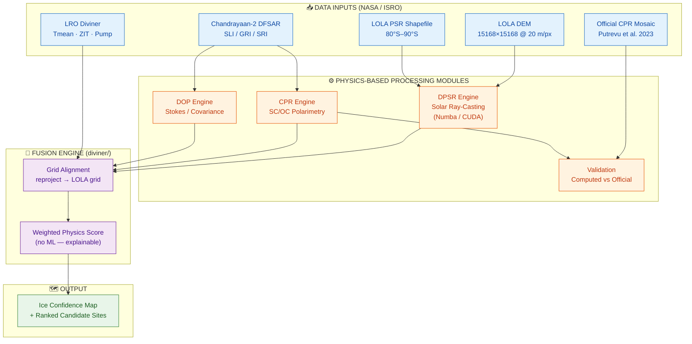
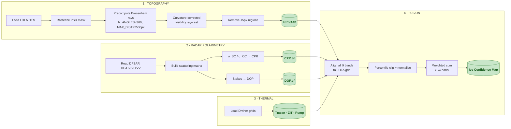
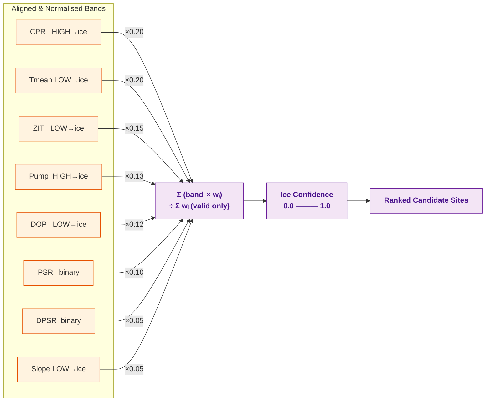
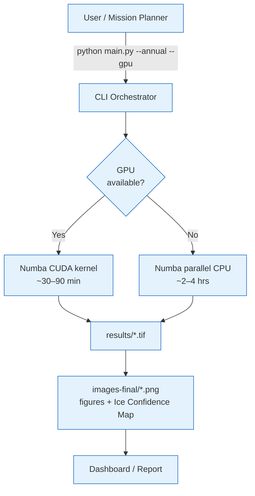

# Wireframes & Mock Diagrams — Proposed Solution

**Project:** Multi-Sensor Detection of Water-Ice Stability Zones at the Lunar South Pole
**Pipeline:** Topographic Shadow (DPSR) + DFSAR Radar Polarimetry (CPR/DOP) + Diviner Thermal → **Ice Confidence Map**

> These diagrams are written in **Mermaid** (render natively on GitHub / VS Code / most Markdown viewers)
> plus **ASCII wireframes** for the presentation dashboard. Paste the Mermaid blocks into
> [mermaid.live](https://mermaid.live) to export high-resolution PNG/SVG for the slide deck.

---

## 1. System Architecture (High-Level Block Diagram)



---

## 2. End-to-End Data Flow (Pipeline Sequence)



---

## 3. Fusion Engine — Weighted Ice Confidence Score (Internal Detail)



Every weight and direction (HIGH/LOW → ice) is tied to a published reference — the fusion is
**fully explainable, no machine-learning black box.**

---

## 4. Results Dashboard — UI Wireframe (Mockup)

A proposed front-end to explore the output. This is a *concept mockup* of how a mission planner
would interact with the generated rasters.

```
╔══════════════════════════════════════════════════════════════════════════════╗
║  🌙  LUNAR SOUTH POLE — WATER-ICE STABILITY EXPLORER          [⚙ Settings] [?] ║
╠═══════════════════╦══════════════════════════════════════════════════════════╣
║  LAYERS  (toggle) ║                                                          ║
║  ─────────────────║           ┌───────────────────────────────┐            ║
║  ☑ Ice Confidence ║           │                               │  ┌───────┐ ║
║  ☐ DPSR mask      ║           │      ●  Shackleton            │  │ LEGEND│ ║
║  ☐ PSR mask       ║           │         ◍ Faustini  ★         │  │ ▓ 0.8+│ ║
║  ☐ CPR (radar)    ║           │    ◍ Haworth                  │  │ ▒ 0.5 │ ║
║  ☐ DOP            ║           │        ◍ Shoemaker    ★       │  │ ░ 0.2 │ ║
║  ☐ Tmean (thermal)║           │   ◍ Cabeus                    │  │ · 0.0 │ ║
║  ☐ DEM / hillshade║           │              ⊕ South Pole     │  └───────┘ ║
║                   ║           │                               │            ║
║  OPACITY          ║           │   ★ = top-ranked ice site     │  ┌───────┐ ║
║  [====●======] 60%║           └───────────────────────────────┘  │ ZOOM  │ ║
║                   ║                                                │ [+][-]│ ║
║  BASEMAP          ║   Lat/Lon: 87.18°S, 12.4°E   Confidence: 0.82│ [⌖ ]  │ ║
║  ( ) DEM  (●) Hill║                                                └───────┘ ║
╠═══════════════════╩══════════════════════════════════════════════════════════╣
║  📊 SELECTED SITE:  Faustini crater floor                                     ║
║  ┌─────────────┬─────────────┬─────────────┬─────────────┬─────────────┐    ║
║  │ CPR    1.24 │ DOP    0.11 │ Tmean  62 K │ DPSR    ✓   │ Rank   #2   │    ║
║  │ ▲ ice-like  │ ▼ ice-like  │ ▼ cold trap │ dbl-shadow  │ of 148 PSR  │    ║
║  └─────────────┴─────────────┴─────────────┴─────────────┴─────────────┘    ║
║  [ Export GeoTIFF ]  [ Export CSV of ranked sites ]  [ Generate Report ]     ║
╚══════════════════════════════════════════════════════════════════════════════╝
```

### Ranked Candidate Sites — Table View (Mockup)

```
┌──────┬──────────────┬──────────┬──────┬──────┬────────┬──────┬─────────────┐
│ Rank │ Site         │ Conf.    │ CPR  │ DOP  │ Tmean  │ DPSR │ Area (km²)  │
├──────┼──────────────┼──────────┼──────┼──────┼────────┼──────┼─────────────┤
│  1   │ Shoemaker-A  │  0.87 ▓▓ │ 1.31 │ 0.09 │  58 K  │  ✓   │   0.98      │
│  2   │ Faustini-fl  │  0.82 ▓▓ │ 1.24 │ 0.11 │  62 K  │  ✓   │   1.19      │
│  3   │ Haworth-NW   │  0.78 ▓  │ 1.18 │ 0.13 │  64 K  │  ✓   │   0.96      │
│  4   │ Cabeus-rim   │  0.71 ▓  │ 1.09 │ 0.14 │  71 K  │  ✓   │   0.44      │
│  …   │ …            │  …       │ …    │ …    │  …     │  …   │   …         │
└──────┴──────────────┴──────────┴──────┴──────┴────────┴──────┴─────────────┘
       [ Sort by: ●Confidence ○CPR ○Temp ○Area ]   [ Filter: DPSR-only ☑ ]
```

---

## 5. Processing Mode / Deployment View (Optional)



---

### Notes for the slide deck
- Diagrams 1–3 & 5 are **Mermaid** → export SVG/PNG at [mermaid.live](https://mermaid.live) for crisp slides.
- Diagram 4 is the **UI wireframe** — the pipeline itself is headless (CLI + GeoTIFF/PNG outputs);
  the dashboard is a *proposed* presentation layer, appropriate to label "future work / concept".
- Color legend used throughout: 🟦 inputs · 🟧 processing · 🟪 fusion · 🟩 outputs.
